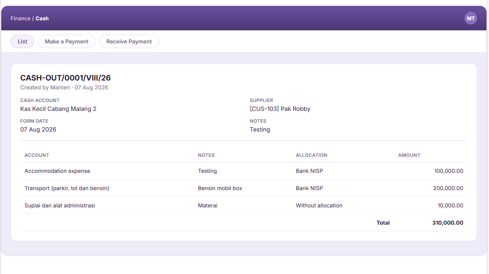

# Edit Cash Out

## EC.F1 - Redirect to login page because user unauthenticated

* **Given** I have not logged in
* **When** I type /finance/point/cashout/1 into browser
* **Then** I should be redirected to the login page

>)

## EC.F2 - Redirect to the forbidden page because user don't have permission edit\_cash out

* **Given** I already logged in
* **And** I do not have permission to edit cash out
* **When** I open the page /finance/point/cashout/1/
* **Then** I can't see button edit on detail page&#x20;

<figure><figcaption></figcaption></figure>

## EC.F3 - The system displays the message "cash account is required" because the user didn't enter a cash account

* **Given** I already logged in
* **And** I have permission to edit cash out
* **And** I am on the page /finance/point/cashout/1
* **When** I click "Edit" button

<figure><figcaption></figcaption></figure>

* **And** the form is prefilled with the existing cash out data

<figure><figcaption></figcaption></figure>

* **And** the columns cash account and account display only the charts of accounts accessible to me
* **And** I clear column cash account

<figure><figcaption></figcaption></figure>

* **And** I click submit

<figure><figcaption></figcaption></figure>

* **Then** I should see the message "Cash account is required"

<figure><figcaption></figcaption></figure>

* **And** I should remain on the edit page

## EC.F4 - The system displays the message "Payment to is required" because the user didn't enter a payment to

* **Given** I already logged in
* **And** I have permission to edit cash out
* **And** I am on the page /finance/point/cashout/1
* **When** I click "Edit" button

<figure><figcaption></figcaption></figure>

* **And** the form is prefilled with the existing cash out data

<figure><figcaption></figcaption></figure>

* **And** the columns cash account and account display only the charts of accounts accessible to me
* **And** I clear column payment to

<figure><figcaption></figcaption></figure>

* **And** I click submit

<figure><figcaption></figcaption></figure>

* **Then** I should see the message "Payment to is required"

<figure><figcaption></figcaption></figure>

* **And** I should remain on the edit page

## EC.F5 - The system displays the message "account is required" because the user didn't enter an account

* **Given** I already logged in
* **And** I have permission to edit cash out
* **And** I am on the page /finance/point/cashout/1
* **When** I click "Edit" button

<figure><figcaption></figcaption></figure>

* **And** the form is prefilled with the existing cash out data

<figure><figcaption></figcaption></figure>

* **And** the columns cash account and account display only the charts of accounts accessible to me
* **And** I clear column account on the first row

<figure><figcaption></figcaption></figure>

* **And** I click submit

<figure><figcaption></figcaption></figure>

* **Then** I should see the message "Account is required"

<figure><figcaption></figcaption></figure>

* **And** I should remain on the edit page

## EC.F6 - The system displays the message "amount is required" because the user didn't enter an amount

* **Given** I already logged in
* **And** I have permission to edit cash out
* **And** I am on the page /finance/point/cashout/1
* **When** I click "Edit" button

<figure><figcaption></figcaption></figure>

* **And** the form is prefilled with the existing cash out data

<figure><figcaption></figcaption></figure>

* **And** the columns cash account and account display only the charts of accounts accessible to me
* **And** I clear column amount on the first row

<figure><figcaption></figcaption></figure>

* **And** I click submit

<figure><figcaption></figcaption></figure>

* **Then** I should see the message "Amount is required"

<figure><figcaption></figcaption></figure>

* **And** I should remain on the edit page

## EC.F7 - The system displays the message "Please enter a valid amount using numbers only." because the user didn't enter an valid amount

* **Given** I already logged in
* **And** I have permission to edit cash out
* **And** I am on the page /finance/point/cashout/1
* **When** I click "Edit" button

<figure><figcaption></figcaption></figure>

* **And** the form is prefilled with the existing cash out data

<figure><figcaption></figcaption></figure>

* **And** the columns cash account and account display only the charts of accounts accessible to me
* **And** I type "abc" into column amount on the first row

<figure><figcaption></figcaption></figure>

* **And** I click submit

<figure><figcaption></figcaption></figure>

* **Then** I should see the message "Please enter a valid amount using numbers only"

<figure><figcaption></figcaption></figure>

* **And** I should remain on the edit page

## EC.F8 - The system displays the message "Amount must be greater than zero." because the user didn't enter an amount greater than zero

* **Given** I already logged in
* **And** I have permission to edit cash out
* **And** I am on the page /finance/point/cashout/1
* **When** I click "Edit" button

<figure><figcaption></figcaption></figure>

* **And** the form is prefilled with the existing cash out data

<figure><figcaption></figcaption></figure>

* **And** the columns cash account and account display only the charts of accounts accessible to me
* **And** I type "0" into column amount on the first row

<figure><figcaption></figcaption></figure>

* **And** I click submit

<figure><figcaption></figcaption></figure>

* **Then** I should see the message "Amount must be greater than zero"

<figure><figcaption></figcaption></figure>

* **And** I should remain on the edit page

## EC.S1 : The system displays the message "Successfully updated"

* **Given** I already logged in
* **And** I have permission to edit cash out
* **And** I am on the page /finance/point/cashout/1
* **When** I click "Edit" button

<figure><figcaption></figcaption></figure>

* **And** the form is prefilled with the existing cash out data

<figure><figcaption></figcaption></figure>

* **And** the columns cash account and account display only the charts of accounts accessible to me
* **And** I type "Edit testing" into column notes on the first row

<figure><figcaption></figcaption></figure>

* **And** I type "150000" into column amount on the first row

<figure><figcaption></figcaption></figure>

* **And** I click submit

<figure><figcaption></figcaption></figure>

* **Then** I should see the notification "Successfully updated"
* **And** I should be redirected to the cash out detail page
